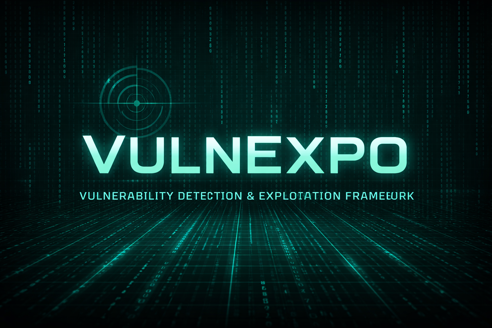

# 🔥 VULNEXPO — Vulnerability Detection & Exploitation Framework

 

> **“Detect the weakness. Exploit the reality.”**

VULNEXPO is a **modular cybersecurity exploitation framework** designed to bridge the gap between **vulnerability detection** and **controlled exploitation**, built for **learning, labs, and authorized environments**.

## 🚀 Why VULNEXPO?

Most tools stop at detection.  
VULNEXPO is built with a single mindset:

> **Detection without exploitation is incomplete security knowledge.**

This project focuses on:
- Understanding *why* a vulnerability exists
- Mapping services → CVEs → exploits
- Executing controlled exploitation using Metasploit integration

## 🧠 Core Features

### 🔍 Vulnerability Detection (VD Module)
- Service & version detection using Nmap
- Aggressive and normal scan modes
- CVE mapping via internal signature database
- Confidence-based exploit candidate scoring
- JSON-based scan result storage

### 💥 Exploitation Engine (EXPLOIT Module)
- Auto-load exploit candidates from VD results
- Manual or automatic exploit selection
- LIVE / DRY execution modes
- Metasploit framework integration (via `msf_adapter`)
- Real-time exploit output streaming

### 🔌 Metasploit Integration
- Uses `msfconsole` under the hood
- Supports real exploit execution in LAB environments
- Designed for future payload & session handling expansion

---

## 🗂 Project Structure

VULNEXPO/
├── core/
│ ├── config.py
│ ├── io_manager.py
│ ├── msf_adapter.py
│ ├── vpn_manager.py
│
├── modules/
│ ├── vuln_detect.py
│ ├── exploit.py
│ ├── vuln_signatures.py
│
├── utils/
│ ├── banner.py
│ ├── colors.py
│ ├── logger.py
│ ├── help_text.py
│
├── results/
├── logs/
├── reports/
├── sessions/
├── tests/
│
├── main.py
├── requirements.txt
├── LICENSE
└── README.md

---

## ⚙️ Installation

### Requirements
- Python 3.9+
- Nmap
- Metasploit Framework
- Linux (Kali Linux recommended)

### Setup

git clone https://github.com/charanvoonna/VULNEXPO
cd VULNEXPO
python3 -m venv venv
source venv/bin/activate
pip install -r requirements.txt

▶️ Usage

  --> python main.py

Basic Workflow

1 . Select network mode (VPN / Tor / None)
2 . Run Vulnerability Detection
3 . Review exploit candidates
4 . Select exploit
5 . Execute LIVE exploitation (authorized labs only)

🔍 Vulnerability Detection :

--> use VD

--> set TARGET <IP>

--> set LIVE true

--> run

💣 Exploit Mapping:

--> use exploit

--> show candidates

--> select <id>

--> show selected

 🔐 VPN Support :

--> OpenVPN support available

--> User-supplied .ovpn configuration required

--> proxy VPN support also avaiable (PROXY)

🧪 Tested Environments

    --> Kali Linux
    --> Metasploitable2 && Authorized local lab networks only

⚠️ Legal & Ethical Warning

    This tool is for EDUCATIONAL and AUTHORIZED LAB USE ONLY.
     Running VULNEXPO against systems you do not own or have permission to test is illegal.
        *The author takes no responsibility for misuse.

 🧭 Roadmap:

   --> Payload auto-selection
   
   --> Session management
   
   --> Post-exploitation modules
   
   --> Report generation (HTML/PDF)
   
   --> CVE auto-update engine

👨‍💻 Author:

  CHARAN VOONNA 
  Cybersecurity | Exploitation | VAPT |
  
